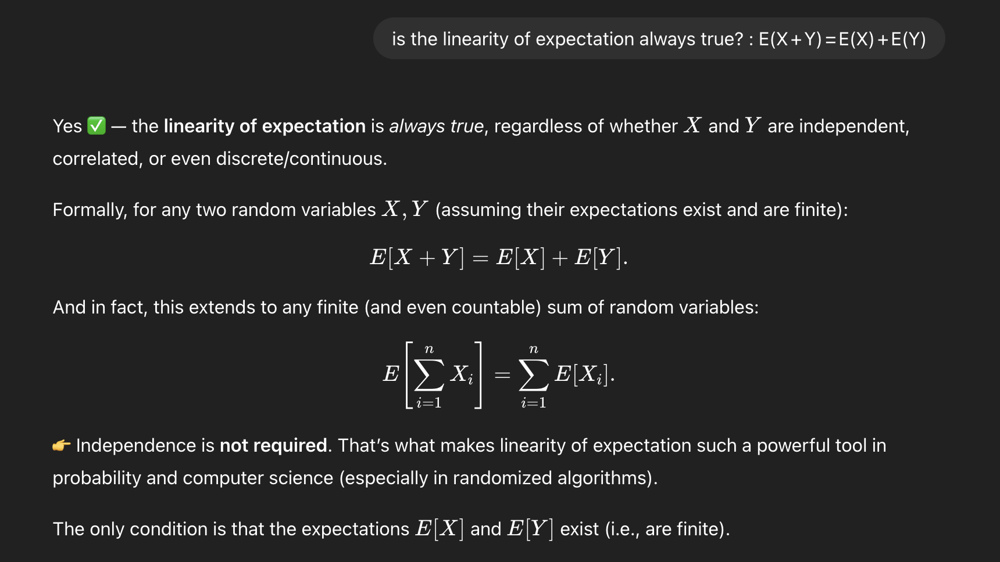
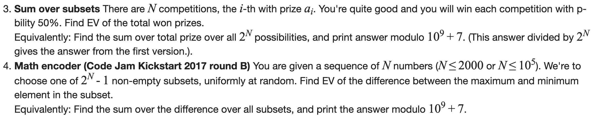

# EV / LOE / Contribution

 
     **[https://codeforces.com/blog/entry/62690](https://codeforces.com/blog/entry/62690)**
  
     
**(try the contribution technique problems: 4 & 6)**
 
 
     
**There is often a recursive, dp way of solving Probability problems. (refer to DP Folder)**

 

 
     

**Because of LoE:
EV(no. of Ace, drawing out 10 cards, w replacement)
 = 
EV(no. of Ace, drawing out 10 cards, w/o replacement) 
= 
EV(no. of Ace, drawing out 10 cards all at once) 
= 
10 * E(no. of Ace, in 1 or first draw)

P(1st draw is Ace) = P(ith draw is Ace) 
Look at it by shuffling the deck, then ith draw is the ith index card in the shuffled deck.**
 

 
     

**Understand that these 2 POV of problems are equivalent.**

 
Contribution technique is more visible, when doing it from Second Problem POV.

 
     **Contribution technique is when you need to calc. a final answer, but then change perspective to what is each component’s contribution to the final answer.
It is closely connected to Linearity of Expectation.**
 