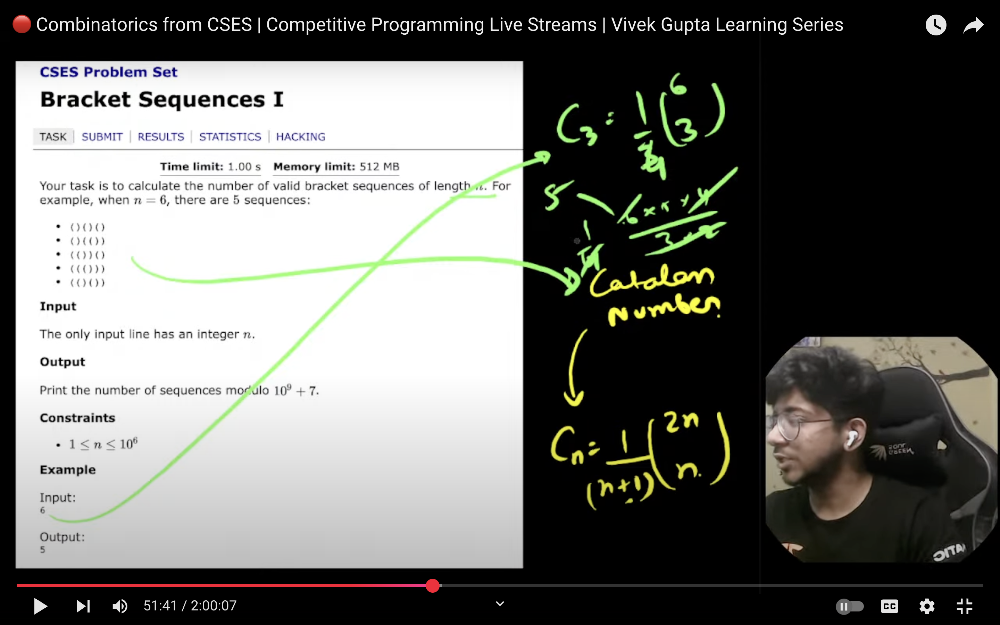
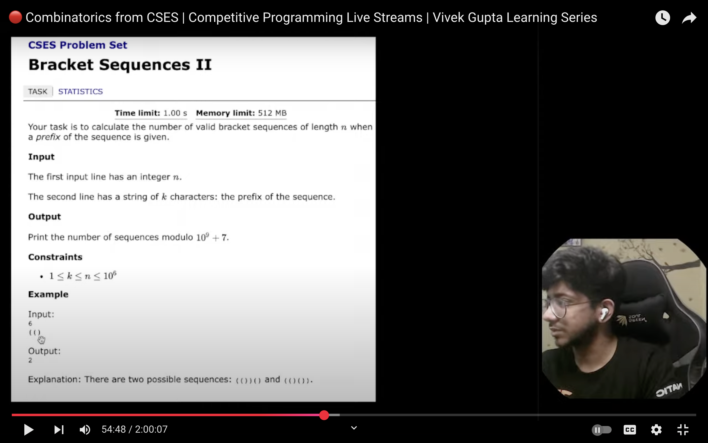
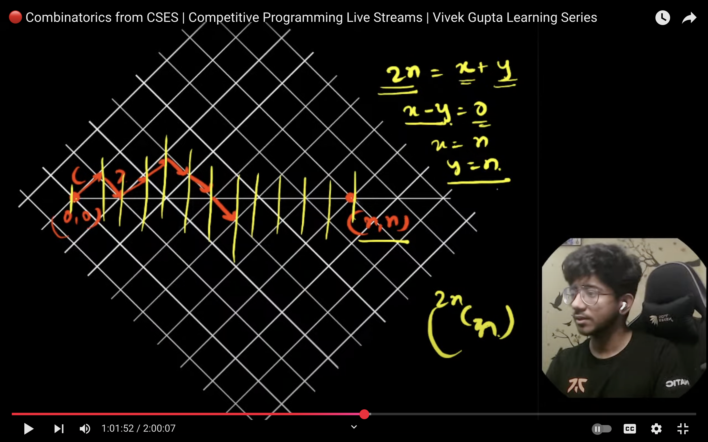
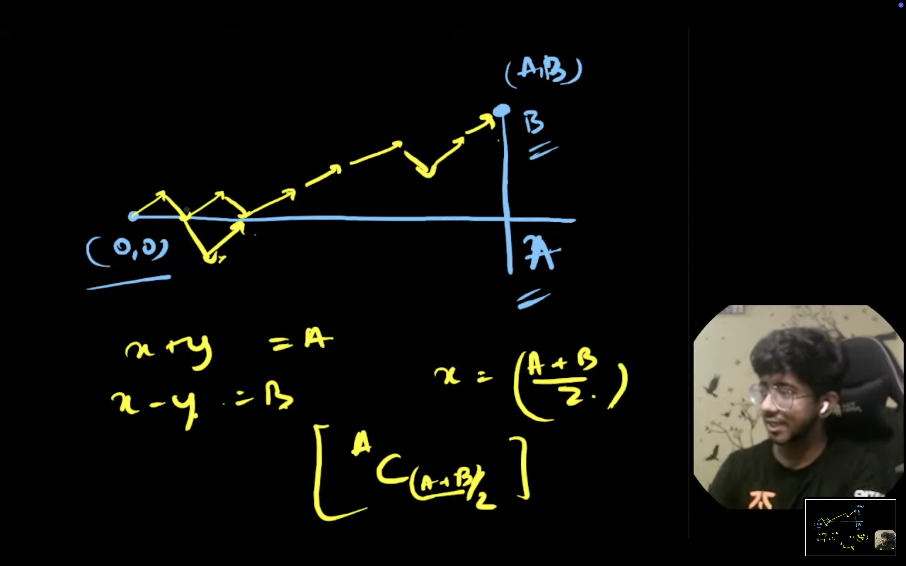
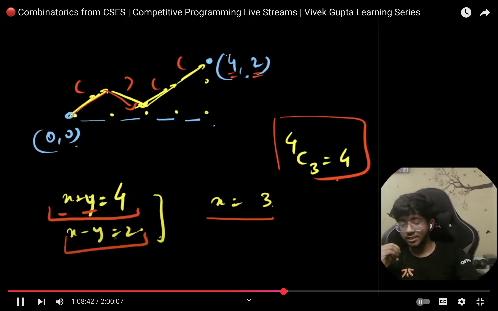
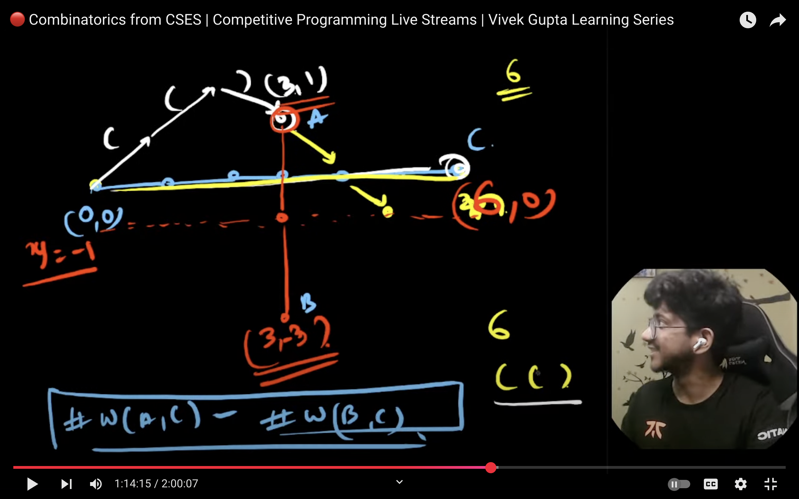
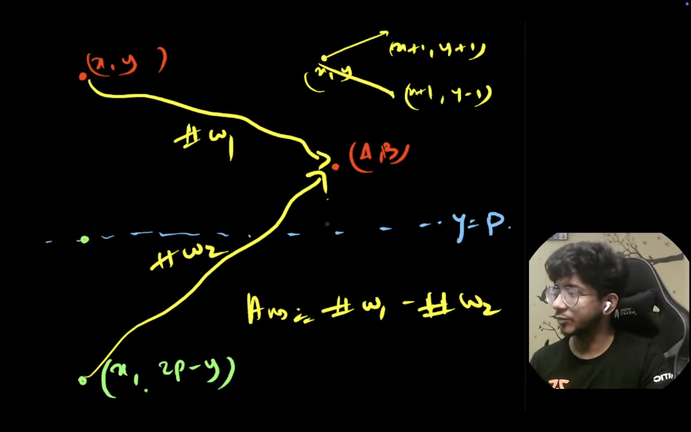

# Valid Bracket Sequence type problems

## Closed form

## DP way: Without any prefix string, without any Balance/Line restriction

## DP way: With prefix string already made, without any Balance/Line restriction

## DP way: With prefix string already made, with Line/Balancing restriction
*(VBS ka constraint) (BS2 ka soln):*

