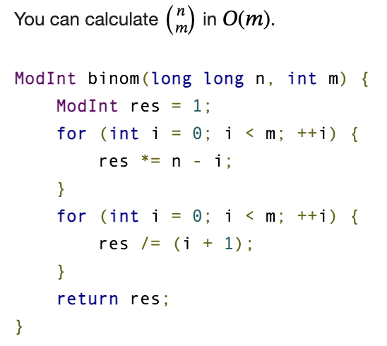

# nCr MOD :

 
     # **DONT FORGET TO INIT**
 
 
     int binpow(int a, int b, int mod)
{
    int res = 1ll;
    while (b > 0)
    {
        if (b & 1ll)
            res = (res * a) % mod;
        a = (a * a) % mod;
        b >>= 1;
    }
    return res % mod;
}

int inversemod(int a, int mod)
{
    return binpow(a, mod - 2ll, mod);
}

int divmod(int a, int b, int c)
{
    return ((a % c) * inversemod(b, c)) % c;
}
int fact[N], invfact[N];
void init(){

    int p = mod;
    fact[0] = 1;
    int i = 0;
    for(i = 1;i<N; i++){
        fact[i] = (fact[i-1]*i)%p;
    }
    i--;
    invfact[i] = binpow(fact[i], p-2, p);
    for(i--; i>=0; i--){
        invfact[i] = invfact[i+1]*(i+1)%p;
    }
}

int nCr(int n, int r){
    if(r > n || n < 0 || r < 0) return 0;
    if(n >= N){
        int cnt = 1;
        for(int i =0; i<r; i++)
            cnt = (cnt % mod * (n - i)%mod) % mod;
        int ans = (cnt%mod * binpow(fact[r], mod - 2, mod)%mod) % mod;
        return ans;
    }
    else{
        return fact[n]*invfact[r]%mod*invfact[n-r]%mod;
    }
}

  
     
 
