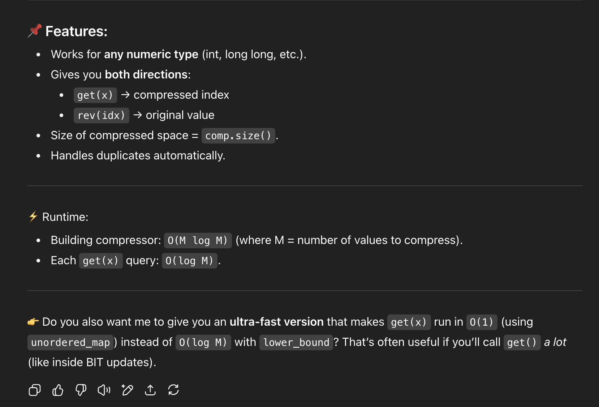

# Coordinate Compression

```cpp
    map<int,int> mp;
    f(i,n){
        mp[a[i]]++;
    }
    int cc = 1;
    for(auto &it : mp){
        it.ss = cc++;
    }
    f(i,n){
        a[i] = mp[a[i]];
    }
```

# Faster way / chatGPT:

```cpp
// Compresses values in `vals` to [0 .. unique-1] while preserving order
// Returns: mapping function + compressed array
template <typename T>
struct Compressor {
    vector<T> vals;   // sorted unique values
    
    // Build from input vector
    Compressor(const vector<T>& input) {
        vals = input;
        sort(vals.begin(), vals.end());
        vals.erase(unique(vals.begin(), vals.end()), vals.end());
    }
    
    // Get compressed index of value x
    int get(T x) const {
        return int(lower_bound(vals.begin(), vals.end(), x) - vals.begin());
    }
    
    // Recover original value from compressed index
    T rev(int idx) const {
        return vals[idx];
    }
    
    // Return size of compressed space
    int size() const {
        return (int)vals.size();
    }
};

// Example usage:
int main() {
    vector<long long> arr = {1000000000, 5, 7, 1000000000, 6};
    vector<long long> queries = {7, 8};
    
    // Merge everything you want to compress
    vector<long long> all = arr;
    all.insert(all.end(), queries.begin(), queries.end());
    
    Compressor<long long> comp(all);
    
    // Compress array
    vector<int> arrC(arr.size());
    for (int i = 0; i < (int)arr.size(); i++) {
        arrC[i] = comp.get(arr[i]);
    }
    
    // Compress queries
    vector<int> queriesC(queries.size());
    for (int i = 0; i < (int)queries.size(); i++) {
        queriesC[i] = comp.get(queries[i]);
    }
}
```



```cpp
template <typename T>
struct FastCompressor {
    vector<T> vals;                    // sorted unique values
    unordered_map<T, int> mp;          // map original → compressed
    
    // Build from input vector
    FastCompressor(const vector<T>& input) {
        vals = input;
        sort(vals.begin(), vals.end());
        vals.erase(unique(vals.begin(), vals.end()), vals.end());
        
        mp.reserve(vals.size() * 2);   // avoid rehashing
        mp.max_load_factor(0.7);
        
        for (int i = 0; i < (int)vals.size(); i++) {
            mp[vals[i]] = i;
        }
    }
    
    // Get compressed index of value x
    inline int get(T x) const {
        return mp.at(x);  // O(1) expected
    }
    
    // Recover original value from compressed index
    inline T rev(int idx) const {
        return vals[idx];
    }
    
    // Size of compressed space
    inline int size() const {
        return (int)vals.size();
    }
};

// Example usage:
int main() {
    vector<long long> arr = {1000000000, 5, 7, 1000000000, 6};
    vector<long long> queries = {7, 8};
    
    // Merge everything you want to compress
    vector<long long> all = arr;
    all.insert(all.end(), queries.begin(), queries.end());
    
    FastCompressor<long long> comp(all);
    
    vector<int> arrC(arr.size());
    for (int i = 0; i < (int)arr.size(); i++) {
        arrC[i] = comp.get(arr[i]);
    }
    
    vector<int> queriesC(queries.size());
    for (int i = 0; i < (int)queries.size(); i++) {
        queriesC[i] = comp.get(queries[i]);
    }
}
```


