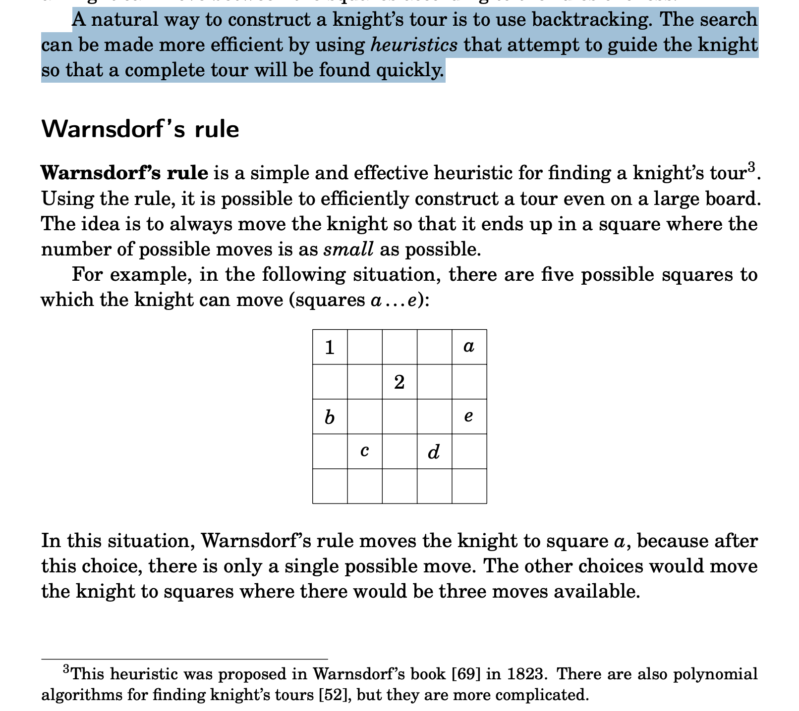
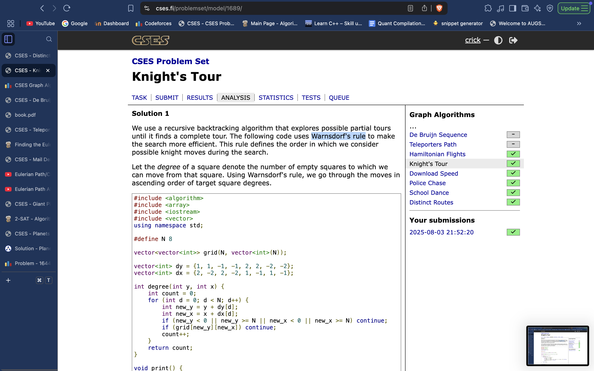

# Heuristic: Warnsdorf's rule

**Knight’s Tour**




```cpp
#include <algorithm>
#include <array>
#include <iostream>
#include <vector>
using namespace std;

#define N 8

vector<vector<int>> grid(N, vector<int>(N));

vector<int> dy = {1, 1, -1, -1, 2, 2, -2, -2};
vector<int> dx = {2, -2, 2, -2, 1, -1, 1, -1};

int degree(int y, int x) {
    int count = 0;
    for (int d = 0; d < N; d++) {
        int new_y = y + dy[d];
        int new_x = x + dx[d];
        if (new_y < 0 || new_y >= N || new_x < 0 || new_x >= N) continue;
        if (grid[new_y][new_x]) continue;
        count++;
    }
    return count;
}

void print() {
    for (int y = 0; y < N; y++) {
        for (int x = 0; x < N; x++) {
            cout << grid[y][x] << " ";
        }
        cout << "\n";
    }
}

void search(int y, int x, int c) {
    if (grid[y][x]) return;
    grid[y][x] = c;

    if (c == N * N) {
        print();
        exit(0);
    }

    vector<array<int, 3>> choices;
    for (int d = 0; d < 8; d++) {
        int new_y = y + dy[d];
        int new_x = x + dx[d];
        if (new_y < 0 || new_y >= N || new_x < 0 || new_x >= N) continue;
        if (grid[new_y][new_x]) continue;
        choices.push_back({degree(new_y, new_x), new_y, new_x});
    }

    sort(choices.begin(), choices.end());
    for (auto [_, new_y, new_x] : choices) {
        search(new_y, new_x, c + 1);
    }

    grid[y][x] = 0;
}

int main() {
    int x, y;
    cin >> x >> y;

    search(y - 1, x - 1, 1);
}
```
