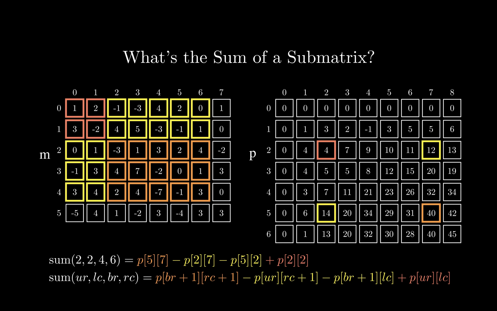
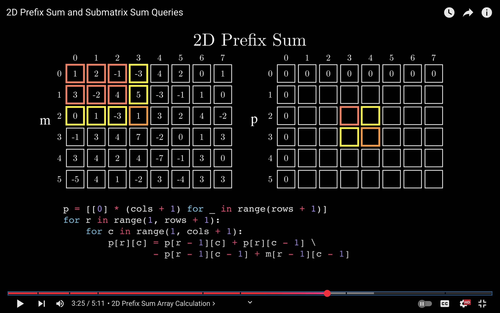

# 2D Prefix Sum

Idea : Inclusion - Exclusion Principle

```cpp
void solve(){
    ll n;
    cin >> n;
    ll q; cin >> q;
    vvi matrix(n, vi(n, 0));
    f(i,n){
        string s; cin >> s;
        f(j,n){
            if(s[j] == '*')
                matrix[i][j] = 1;
        }
    }
    vvi mtx(n+1, vi(n+1, 0));
    for(int i = 0; i<=n; i++){
        for(int j = 0; j<=n; j++){
            if(i==0 || j == 0)
                mtx[i][j] = 0;
            else{
                mtx[i][j] = matrix[i-1][j-1] +
                    mtx[i-1][j] + mtx[i][j-1] -
                    mtx[i-1][j-1];
            }
        }
    }
    while(q--){
        int y1, x1, y2, x2; cin >> y1 >> x1 >> y2 >> x2;
        int row1 = min(y1, y2);
        int row2 = max(y1, y2);
        int col1 = min(x1, x2);
        int col2 = max(x1, x2);
        int ans = mtx[row2][col2]
                - mtx[row1-1][col2]
                - mtx[row2][col1-1]
                + mtx[row1-1][col1-1];
        cans;
    }
}
```


