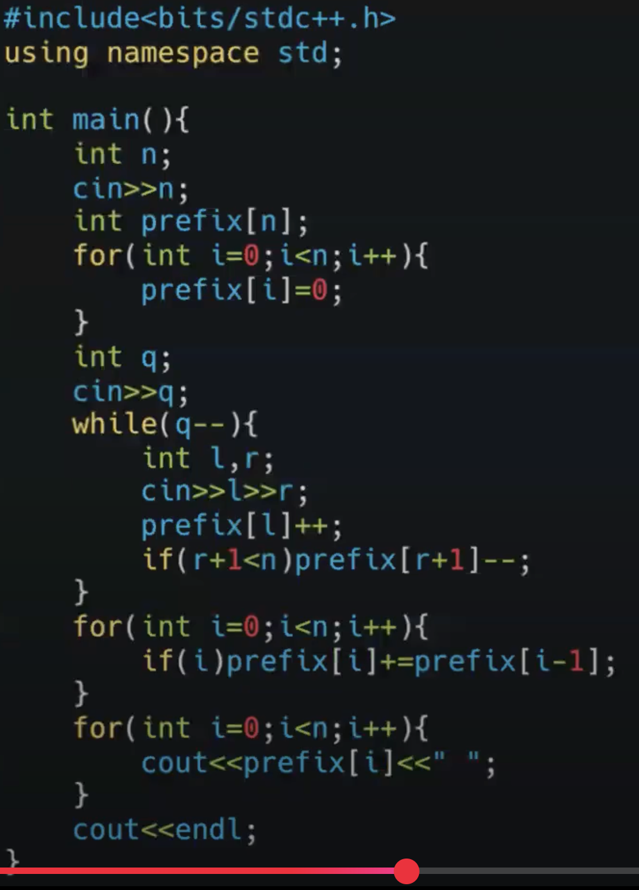
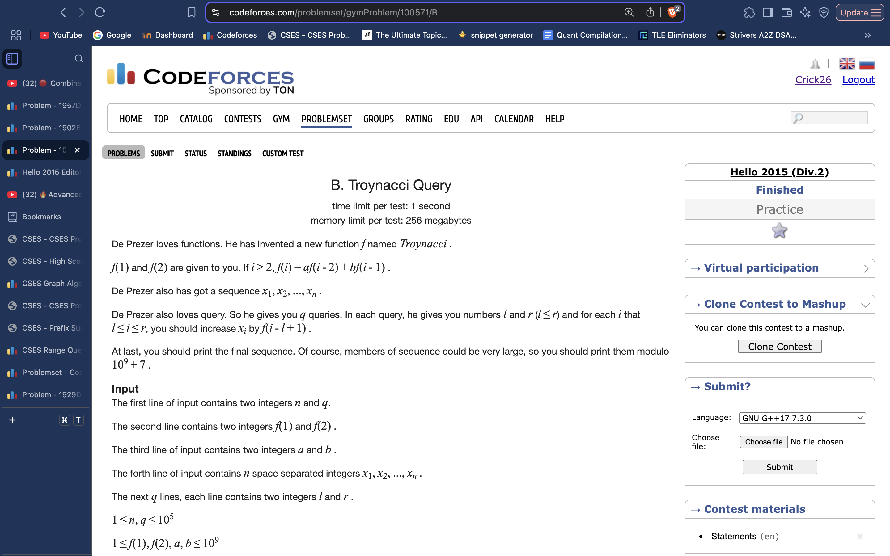
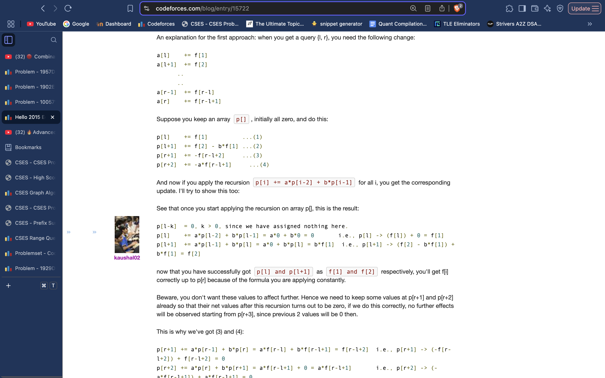

# Partial Sums / Difference Array Technique

( I like to do it without involving the differences from initial array values) , hence, we’ll need to add those values after resweep.

Really tough Partial sums problem:

