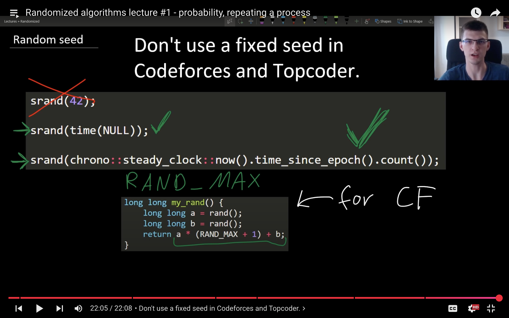

# Millisecond seed Rand() function

#include <bits/stdc++.h>
using namespace std;

*// ------------------- Random Utility -------------------*
void setupRandom() {
    srand(chrono::*steady_clock*::now().time_since_epoch().count());
}

*// Generate random integer in full range [0, RAND_MAX]*
int randInt() {
    return rand();
}

*// Generate random integer in range [l, r]*
int randInRange(int l, int r) {
    return l + rand() % (r - l + 1);
}

*// Generate random floating-point number in [0, 1)*
double randDouble() {
    return (double)rand() / (RAND_MAX + 1.0);
}

*// Generate random floating-point number in range [l, r)*
double randDoubleInRange(double l, double r) {
    return l + (r - l) * randDouble();
}

*// ------------------- Main -------------------*
int main() {
    *ios*::sync_with_stdio(false);
    cin.tie(nullptr);

    setupRandom();  *// Seed random generator (do this only once)*

    cout << "Random ints:\n";
    for (int i = 0; i < 5; i++) {
        cout << randInt() << "\n";
    }

    cout << "\nRandom ints in [10, 20]:\n";
    for (int i = 0; i < 5; i++) {
        cout << randInRange(10, 20) << "\n";
    }

    cout << "\nRandom doubles in [0, 1):\n";
    for (int i = 0; i < 5; i++) {
        cout << randDouble() << "\n";
    }

    cout << "\nRandom doubles in [5.0, 10.0):\n";
    for (int i = 0; i < 5; i++) {
        cout << randDoubleInRange(5.0, 10.0) << "\n";
    }

    return 0;
}

