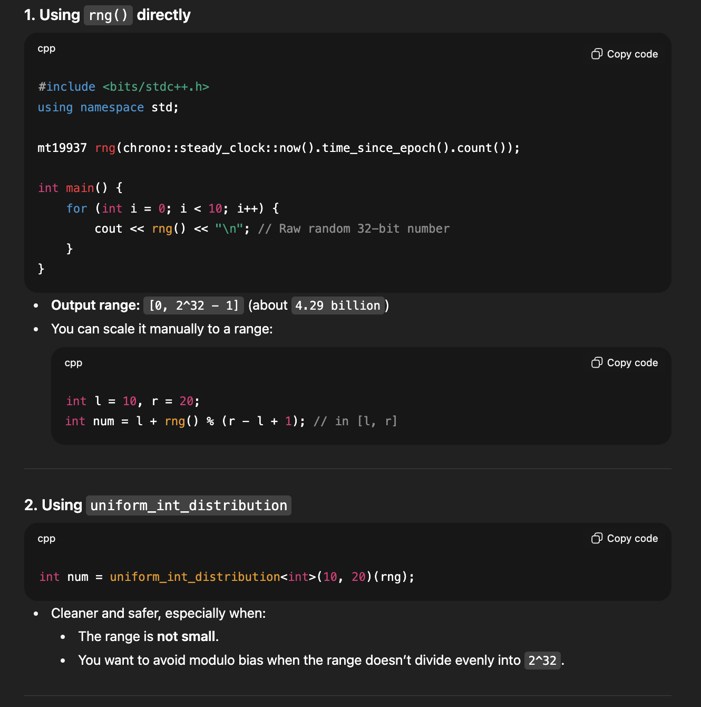
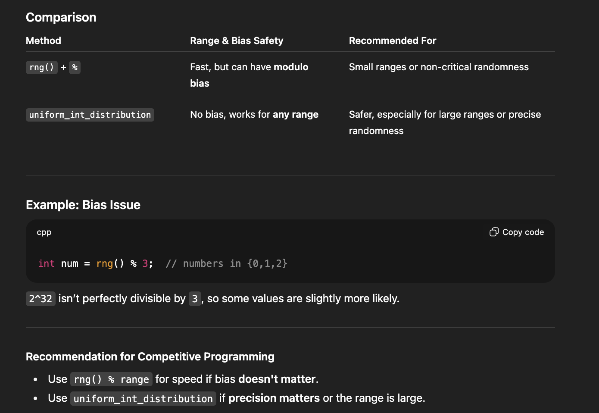
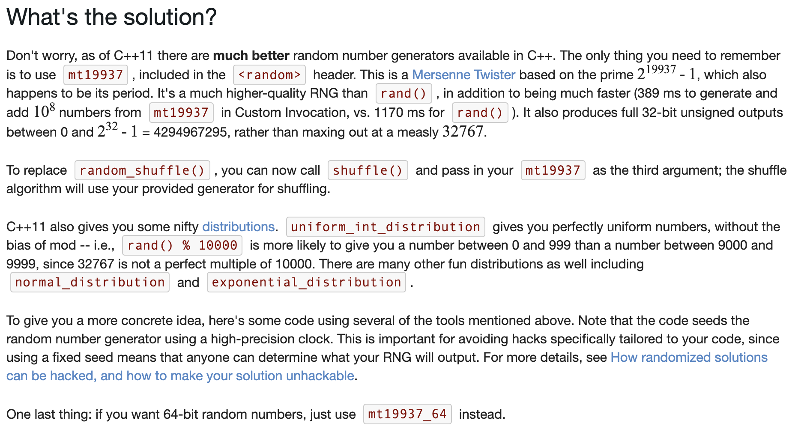
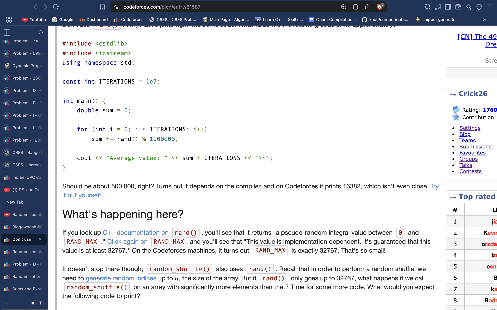
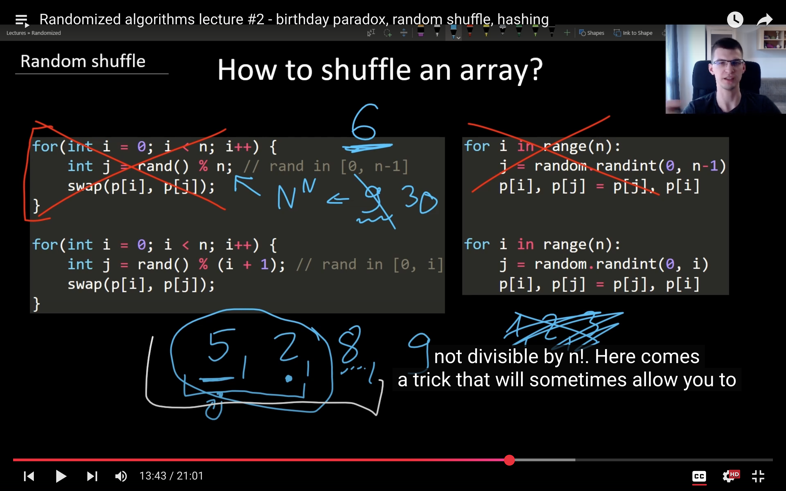

# Theory:

#include <bits/stdc++.h>
using namespace std;

*// ------------------- Random Utility -------------------*

*// Global random engine seeded with steady_clock*
 
     **mt19937 rng(chrono::**
  
     ***steady_clock***
  
     **::now().time_since_epoch().count());**

 
*// --- Helper Functions ---*

 
     ***// Random integer in [l, r]***
  
     
**int randInt(int l, int r) {
    uniform_int_distribution<int> dist(l, r);
    return dist(rng);
}**
 

 
     **// Simpler
/***
 
 
     # **int randint(int l, int r) {**

  
     #     **return rng() % (r - l + 1) + l;**

  
     # **}**

  
     ***/**
 

*// Random double in [l, r)*
double randDouble(double l, double r) {
    uniform_real_distribution<double> dist(l, r);
    return dist(rng);
}

*// Shuffle a container*
 
     **template <typename** 
  
     ***T***
  
     **>
void shuffleContainer(**
  
     ***T***
   
     ***&***
  
     **container) {
    shuffle(container.begin(), container.end(), rng);
}**

 
*// Sample from normal distribution (mean, stddev)*
double randNormal(double mean, double stddev) {
    normal_distribution<double> dist(mean, stddev);
    return dist(rng);
}

*// Sample from exponential distribution (lambda)*
double randExponential(double lambda) {
    exponential_distribution<double> dist(lambda);
    return dist(rng);
}

*// ------------------- Main -------------------*
int main() {
    *ios*::sync_with_stdio(false);
    cin.tie(nullptr);

    *// 1. Random integers*
    cout << "Random integers in [10, 20]:\n";
    for (int i = 0; i < 5; i++)
        cout << randInt(10, 20) << "\n";

    *// 2. Random doubles*
    cout << "\nRandom doubles in [0.0, 1.0):\n";
    for (int i = 0; i < 5; i++)
        cout << randDouble(0.0, 1.0) << "\n";

    *// 3. Shuffle a permutation*
    vector<int> perm = {0, 1, 2, 3, 4, 5, 6, 7, 8, 9};
 
         **shuffleContainer(perm);**
 
    cout << "\nShuffled permutation:\n";
    for (int x : perm) cout << x << " ";
    cout << "\n";

 
         ***// 4. Using uniform_int_distribution in custom swaps, simulates random shuffling***
 
    cout << "\nRandom swaps demo:\n";
 
         **for (int i = 0; i < (int)perm.size(); i++) {
        swap(perm[i], perm[uniform_int_distribution<int>(0, i)(rng)]);
    }**
 
    for (int x : perm) cout << x << " ";
    cout << "\n";

    *// 5. Normal distribution*
    cout << "\nNormal distribution (mean=0, stddev=1):\n";
    for (int i = 0; i < 5; i++)
        cout << randNormal(0, 1) << "\n";

    *// 6. Exponential distribution*
    cout << "\nExponential distribution (lambda=1):\n";
    for (int i = 0; i < 5; i++)
        cout << randExponential(1.0) << "\n";

    return 0;
}
# 

# 
