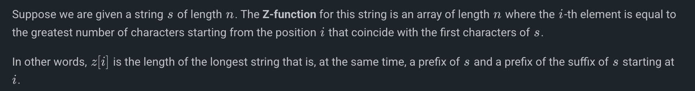
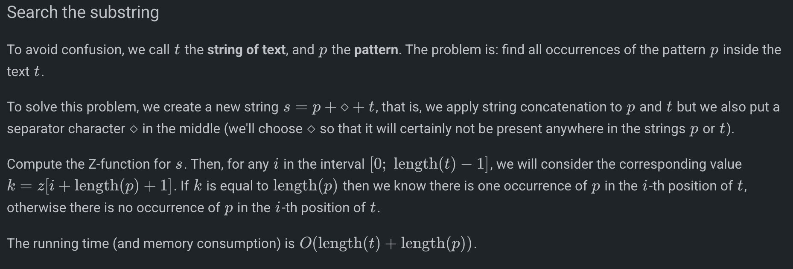
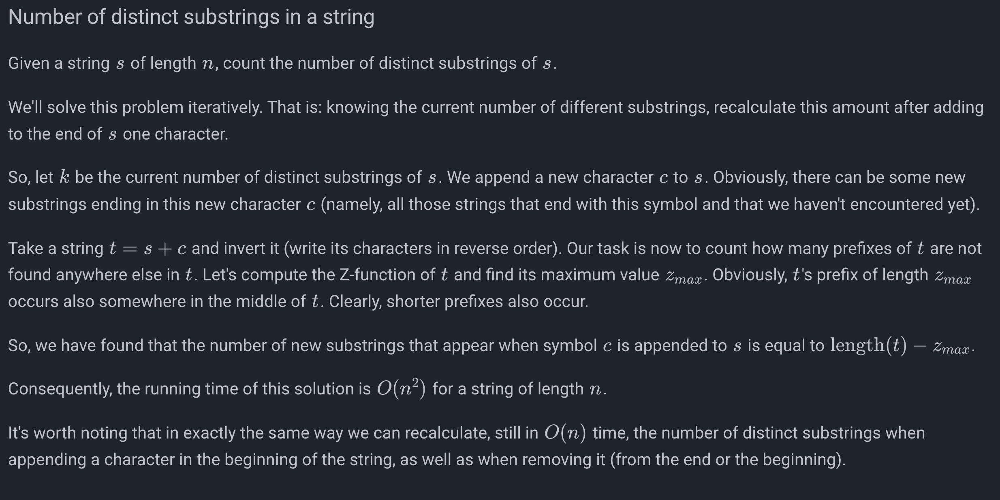
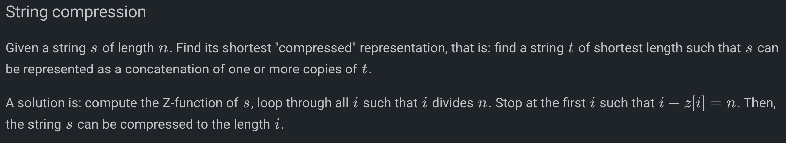

# Z-Function

# 

 
     # vector<int> z_function(string s) {

     int n = s.size();
    vector<int> z(n, 0);
    int l = 0, r = 0;
    for(int i = 1; i < n; i++) {
        if(i < r) {
            z[i] = min(r - i, z[i - l]);
        }
        while(i + z[i] < n && s[z[i]] == s[i + z[i]]) {
            z[i]++;
        }
        if(i + z[i] > r) {
            l = i;
            r = i + z[i];
        }
    }
    return z;
}

 
     Used a lot when problems mention suffixes and prefixes.

  
     e.g. 

  
     [https://cses.fi/problemset/task/1732](https://cses.fi/problemset/task/1732)
 
 
     [https://codeforces.com/problemset/problem/126/B](https://codeforces.com/problemset/problem/126/B)
 
 
     [https://codeforces.com/problemset/problem/432/D](https://codeforces.com/problemset/problem/432/D)
 

