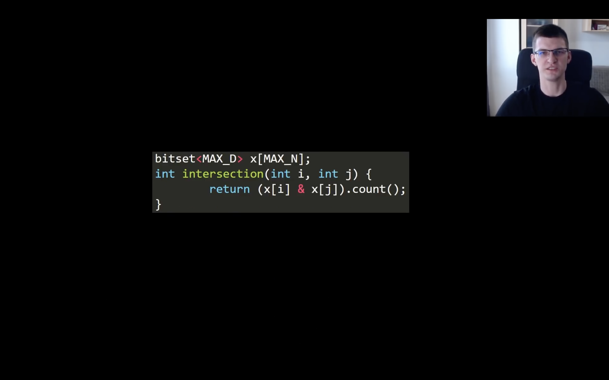
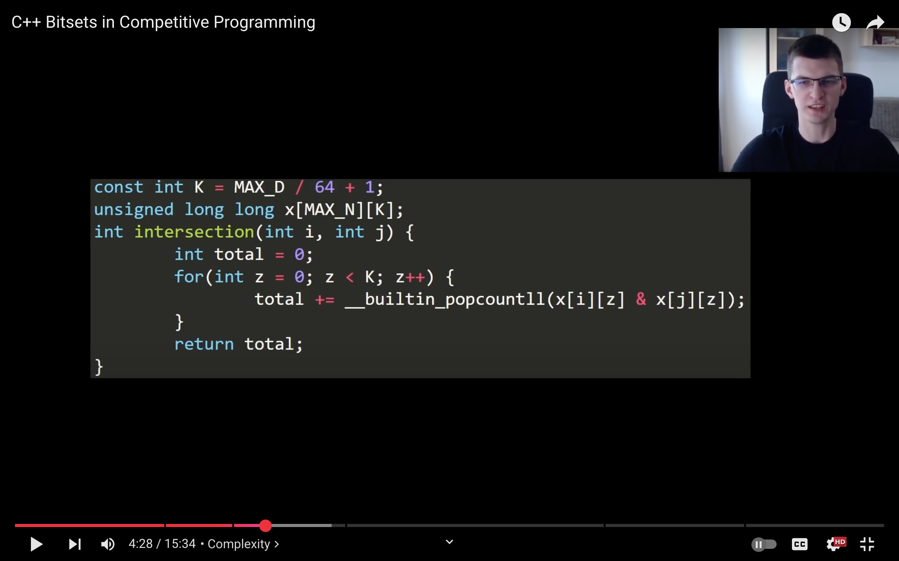
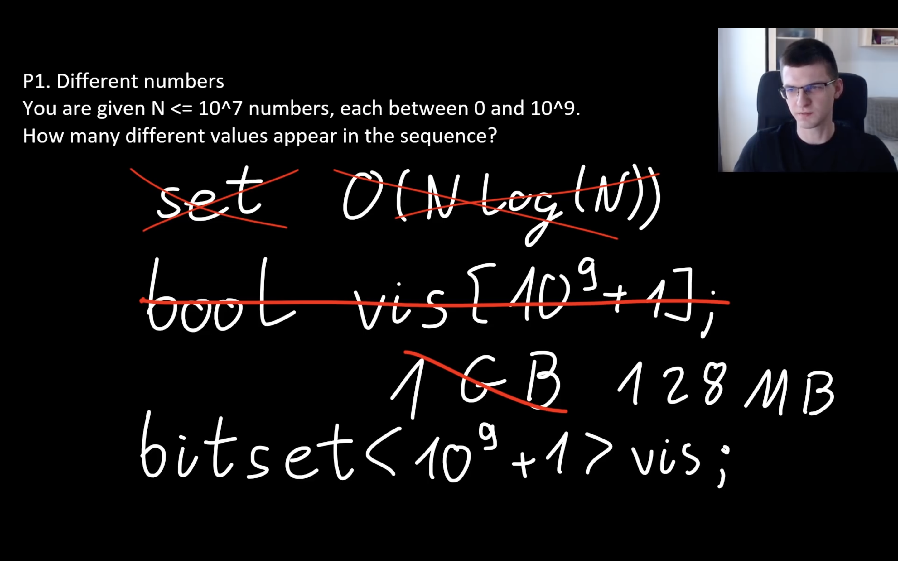
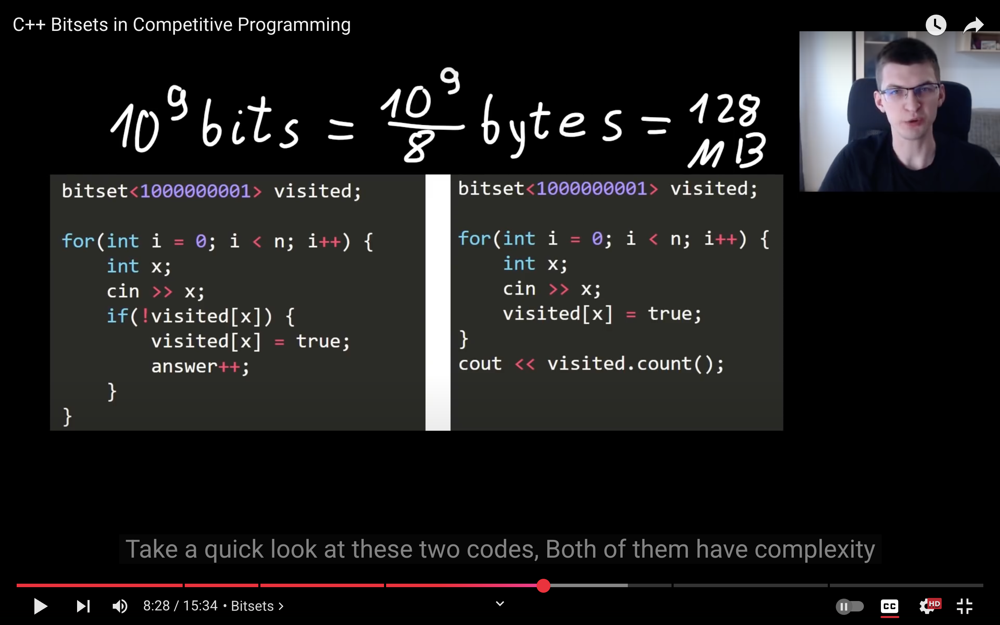
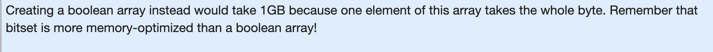
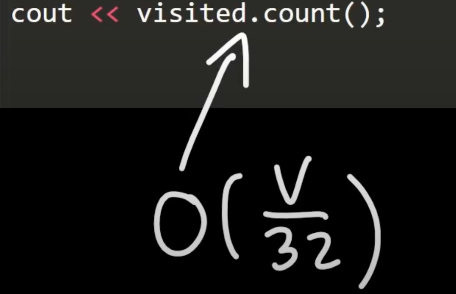

# BITSET under the hood, is just an array of unsigned long longs.

 
     # **(an array of mask integers)**

 
 
     FOR EXAMPLE:
 

SINCE THERE ARE 8 BITS IN EACH BYTE : ( MEMORY IS REDUCED BY FACTOR OF 8 )

 
     SINCE A SYSTEM MIGHT HAVE 1 LONG LONG STORED AS 4 BYTES ( 1 WORD ), THUS, 32 BITS, IT CAN CALC. COUNT OF 4 BYTES IN EFFECTIVELY O(1).
 

