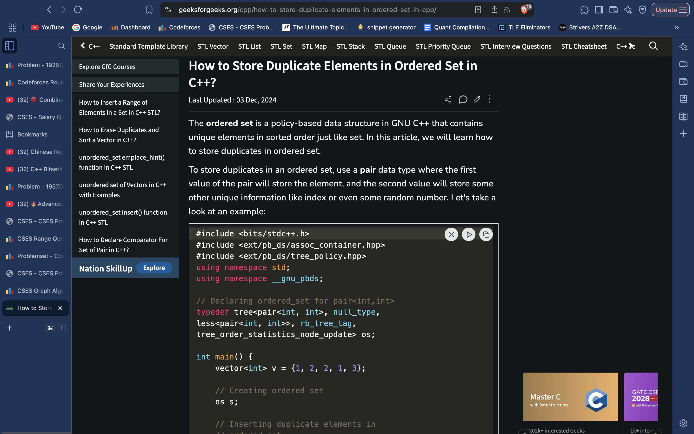

# Ordered Multiset workaround part 1.

#include <bits/stdc++.h>
#include <ext/pb_ds/assoc_container.hpp>
#include <ext/pb_ds/tree_policy.hpp>
using namespace std;
using namespace __gnu_pbds;

// Declaring ordered_set for pair<int,int>
typedef tree<pair<int, int>, null_type, 
less<pair<int, int>>, rb_tree_tag, 
tree_order_statistics_node_update> os;

int main() {
    vector<int> v = {1, 2, 2, 1, 3};
  
  	// Creating ordered set
    os s;

    // Inserting duplicate elements in 
    // ordered set
    for (int i = 0; i < v.size(); i++)
        s.insert({v[i], i});

    for (auto i : s)
        cout << i.first << " ";
    return 0;
}

 
     **Nice practice problem:**

 
#include<bits/stdc++.h>
#include<ext/pb_ds/assoc_container.hpp>
#include<ext/pb_ds/tree_policy.hpp>

using namespace std;
using namespace __gnu_pbds;

typedef tree<pair<int, int>, null_type, 
less<pair<int, int>>, rb_tree_tag, 
tree_order_statistics_node_update> *pbds*; *// find_by_order, order_of_key*

*// solving:*
void solve(){

    int n, q;
    cin >> n >> q;
    vector<int> a(n); 
    for(int i = 0; i<n; i++)
        cin >> a[i];
    *pbds* A;
    for(int i = 0; i<n; i++){
        A.insert({a[i], i});
    }
    while(q--){
        char c; cin >> c;
        if(c == '?'){
            int l, r; cin >> l >> r;
            cout << A.order_of_key({r+1, -1e18}) - A.order_of_key({l, -1e18}) << endl; 
        } else{
            int k, x; cin >> k >> x;
            k--;
            A.erase({a[k], k});
            a[k] = x;
            A.insert({a[k], k});
        }
    }
}

signed main()
{
    *ios_base*::sync_with_stdio(false); cin.tie(0); cout.tie(0);

    *// pre-computation:*

    int t = 1;
    while (t--)
        solve();
    return 0;
}

